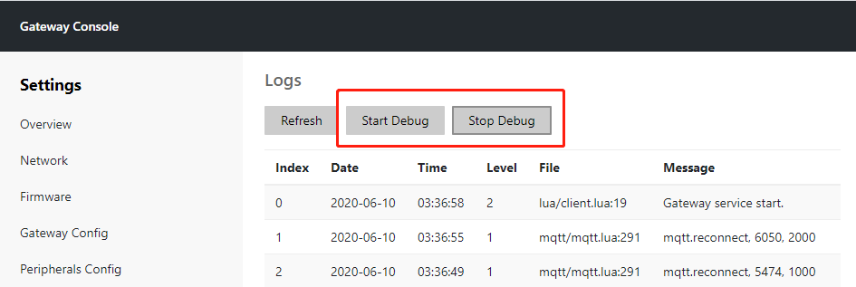
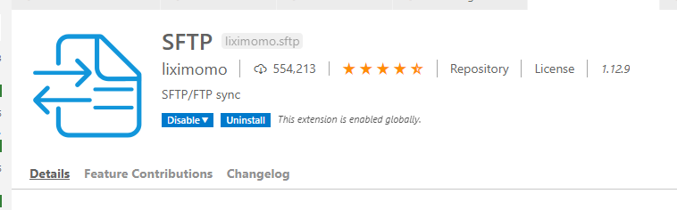
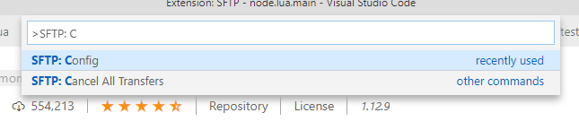
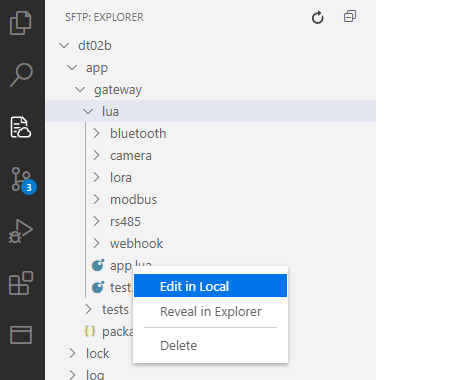

# 应用程序开发指南

本文主要描述如何创建并开发一个新的 Node.lua 应用程序.

## 创建应用

首先在 `/{path-to-node}/app` 目录下创建一个新的应用目录, 如 `"/node/app/test"`.

注意应用目录名全部为小写字母并且不要超过 8 个字节.

然后在这个目录下新建一个名为 `lua/app.lua`  的 Lua 文件做为这个应用的入口.

其次再创建一个名为 `package.json` 的文件来描述这个应用

### 目录结构

- {path-to-node} - Node.lua 根目录
  - app - 应用程序目录
    - {app-name} - 应用程序名称
      - lua - Lua 脚本源代码文件目录
        - app.lua - APP 入口脚本
      - package.json - APP 描述文件

## 应用描述

`package.json` 的内容如下:

```json

{
    "depends": ["lnode", "vision"],
    "description": "Test Framework",
    "name": "test",
    "tags": ["test", "runtime"],
    "version": "1.0.0"
}

```

## 开始编写应用

修改 `lua/app.lua` 文件内容为:

```lua
local app = require('app')

local exports = {}

-- 默认的 action
function exports.init()
    print("usage: lpm test <start|help|test>")
end

-- 实现一个名为 start 的 action
function exports.start(...)
    print("hello", ...)
end

-- 实现一个名为 print 的 action
function exports.print(...)
    print("print", ...)
end

app(exports) -- APP 入口函数, 会根据命令行参数调用这个应用相关的 action

```

这样我们实现一个只有简单打印功能的应用程序

## 运行应用

上面的脚本可以用 lnode 直接执行, 但是更方便的方法是用 lpm 命令来执行:

比如要执行上面应用的 test 方法的方式为:

`lpm test print bar`

运行后会打印:

`print bar`

首先 lpm 会查找名为 test 的应用程序, 然后执行这个应用的 app.lua 文件, 相当于在 
test 目录执行 `lnode lua/app.lua print bar`

但 lpm 会自动查找要执行的应用的目录, 所有会更加方便, 调用方式也更加统一.

### 创建应用链接

创建一个链接文件指向 `lnode` 就可以直接运行相应名称的应用程序了 (类似 busybox 的概念), 如:

创建一个名为 `test` 并指向 lnode 的链接文件, 当直接运行 `test` 文件时，相当于执行 `lnode /path/to/test/lua/app.lua`

## VS Code 开发参考

本节主要介绍如何通过 VS Code 开发 Node.lua 应用

### 开启 Debug 模式

访问网关配置页面，点击 `Start Debug` 进入调试模式



进入调试模式后将会启用以下和调试相关的服务和接口:

- ftp 服务器
- telnet 服务器

启动 FTP 服务:

```shell
# init the FTP server
$ echo "21 stream tcp nowait root ftpd ftpd -w /" > /etc/inetd.conf
$ inetd
```

添加/删除调试用户

```shell
# Add user
$ adduser -D -H debug

# Set password to ''
$ passwd -d debug

# Delete user
$ deluser debug
```

### 安装 SFTP 插件

为 VS Code 安装 SFTP 插件, 可以实现通过 FTP 协议同步源代码



#### 配置 SFTP 插件

运行 `SFTP: Config` 命令, 创建 SFTP 配置文件



配置文件内容如下，请根据实际情况修改：

```json
{
    "name": "dt02b",
    "host": "192.168.1.13",
    "protocol": "ftp",
    "port": 21,
    "username": "debug",
    "remotePath": "/tmp/",
    "uploadOnSave": true,
    "ignore": ["core", "build", "modules"]
}
```

- 开发板 IP 为 192.168.1.13
- 用户名为 debug
- 使用内存文件系统 `/tmp` 来同步存放调试代码
- `uploadOnSave` 表示修改并保存文件时会自动同步到开发板

配置完成后，可以看到开发板上的目录和文件

